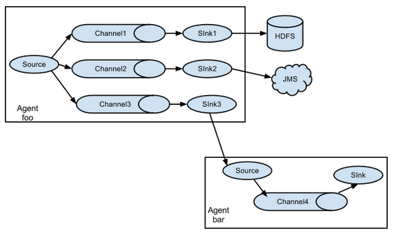
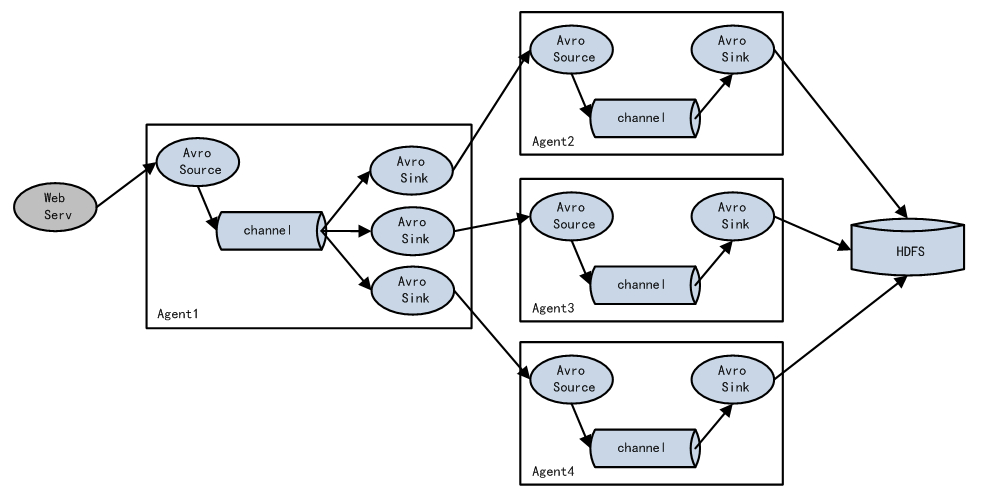
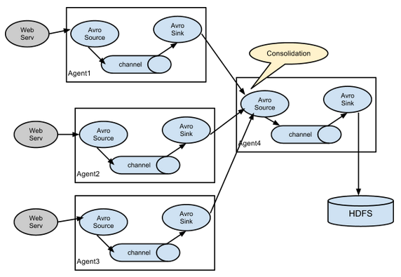

# Flume配置初始

如前面所说，Flume是一个流式架构的框架，数据的读入和写出实际上是分离的，因此Flume的配置只需要对各个组件一一配置，并按照需求将这些配置下相连就行。相连时需要注意两点

- source与channel是一对多的，即一个source可以向多个channel `doput()`数据。
- 一个sink只能从一个channel `take()`数据，但是一个channel可以向多个传输数据。
- ps：另外的一点是在配置各个组件时，在指定type后可以在官方文档上查找配置该type需要哪些配置。

## 单个Agent

使用的配置文件如下。

```java
# 给agent中的组件命名
a1.sources = r1
a1.sinks = k1
a1.channels = c1

# 给source进行配置
a1.sources.r1.type = netcat
a1.sources.r1.bind = localhost
a1.sources.r1.port = 44444

# 给sink进行配置
a1.sinks.k1.type = logger

# 给channel进行配置
a1.channels.c1.type = memoryA
a1.channels.c1.capacity = 10000
a1.channels.c1.transactionCapacity = 1000

# 将各个组件进行绑定
a1.sources.r1.channels = c1
a1.sinks.k1.channel = c1
```

## 多个Agent相连

### 简单的多个Agent相连

配置文件与与之前相同，需要注意两点
- 第一个的sink配置为avrosink，第二个source的sink配置为avrosource。
- 在启动时需要先启动第二个，再启动第一个。

```java
#命名组件 agent1
a1.sources = r1
a1.channels = c1
a1.sinks=s1

#配置source属性设置
a1.sources.r1.type = netcat
a1.sources.r1.bind = hadoop101
a1.sources.r1.port = 4444

#配置channel
a1.channels.c1.type=memory
a1.channels.c1.capacity=2000

#配置arvosink,填写的信息必须和arvosource绑定的信息一致
a1.sinks.s1.type=avro
a1.sinks.s1.hostname=hadoop102
a1.sinks.s1.port=4141

#连接组件，r1source将event放入c1channel
a1.sources.r1.channels = c1
a1.sinks.s1.channel=c1
```

```java
#命名组件 agent2
a1.sources = r1
a1.channels = c1
a1.sinks=s1
#配置source属性设置
a1.sources.r1.type = avro
a1.sources.r1.bind = hadoop102
a1.sources.r1.port = 4141

#配置channel
a1.channels.c1.type=memory
a1.channels.c1.capacity=2000

#配置sink
a1.sinks.s1.type=logger
a1.sinks.s1.maxBytesToLog=100

#连接组件，r1source将event放入c1channel
a1.sources.r1.channels = c1
a1.sinks.s1.channel=c1
```

### 复制和多路复用

Flume支持将事件流向一个或者多个目的地。这种模式可以将相同数据复制到多个channel中，或者将不同数据分发到不同的channel中，sink可以选择传送到不同的目的地。




### 负载均衡和故障转移



配置多个sink实现故障转移。要点是要配置多个sink为一个组，同时配置sinkprocessor为failover SinkProcessor

配置多个sink实现负载均衡。要点是要配置多个sink为一个组，同时配置sinkprocessor为Load balancing Sink Processor。实现均衡有轮询和随机两种方式。
## 聚合


从多个读取的数据写入到同一个Avro Source。 
