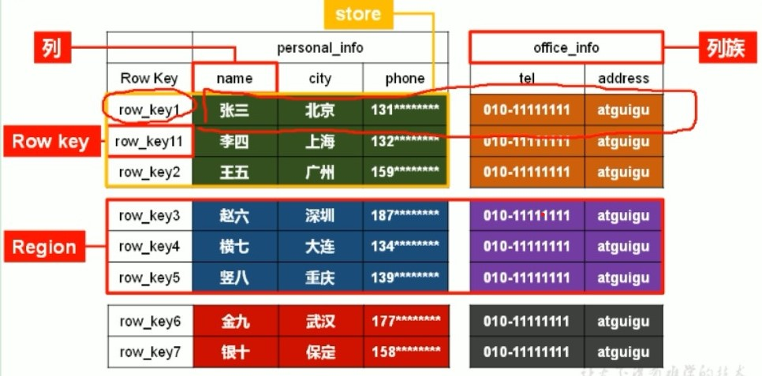

# HBASE简介

Apache HBase is the Hadoop database, a distributed, scalable, big data store. 存大数据的nosql数据库。能存大数据，还能随机读写（怎么做到的）。其具有以下特点：

## HBase的特点

- 海量存储：HBase一定要上亿条数据才有优势。HBase
- 列式存储：HBase根据列族来存储数据，列族下面可以有任意多的列，列族在创建表时必须指定。
- 极易扩展：HBase的扩展性主要体现在两个方面，一个是基于上层处理能力的扩展，一个是基于存储的扩展。其实就是Hadoop的扩展，regionserver可以分布在多台机器上。
- 高并发：即使采用廉价pc，在单台机器上的IO不小，但是在并发的情况下，可以获得高并发低时延的效果。
- 稀疏：在列簇中，可以指定任意多的列，在列数据为空时不补充空值。
- 高容错：Hbase的数据存在HDFS上，HDfs的副本机制保障了高容错
- 高性能：Hbase采用key-value的形式存储，通过key找value，性能很高。
- *架构设计真的复杂，在存小数据上没优势*
- *数据分析能力弱*
- *没有强一致性*

## HBase的数据模型

)

一个列族包含多个列。一个Region包含多个store, 一个列族中的列指示一个store。多个Region构成整个表。

nameSpace:类似于数据库中的库，一个nameSpace在HBase中就是一个目录，默认提供了hbase和defalut两个namespace

table:在定义Table时需要定义列族，类似于表的概念，一个table是hdfs上的namespac下的子目录

row:一行由一个Rowkey和多个列组成

roukey：Row的唯一标识，在排序时会根据rowkey排序，因此要好好配置

Column Faimly :列族。是hbase中的基本存储单位，hbase是面向列族存储。列族就是region下的子目录，。在建表时指定列族的名称和属性（）。

Column qualifier:一个列

time stamp:时间戳

cell是一行中可以存储多个版本的数据，每个版本就交一个cell,cell中的数据全部是按照字节码形式存贮的

Region:由一个表的若干行组成，在Region中的排序按照行建字典排序。region是基于HDFS的，是table下的一个子目录，多个Region由一个RegionServer进程管理。随着数据的增多，region会自动进行切分

RegionServer:负责管理多个Region的get,put,delete请求。负责ddl语句

Master:一个HBASE集群有一个，负责管理表的创建，删除和修改。分配regions到每个RegionServer.

