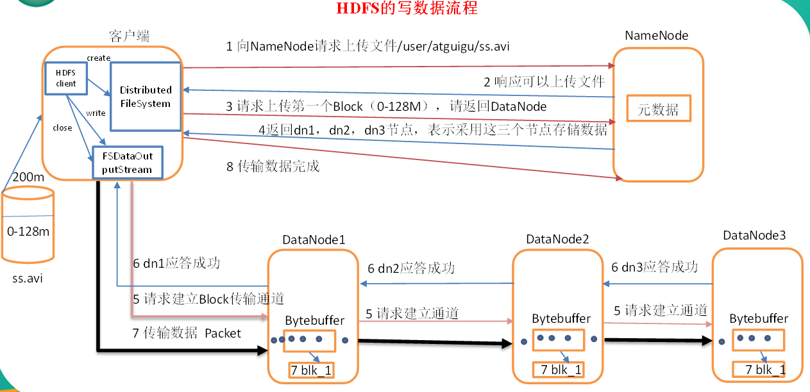
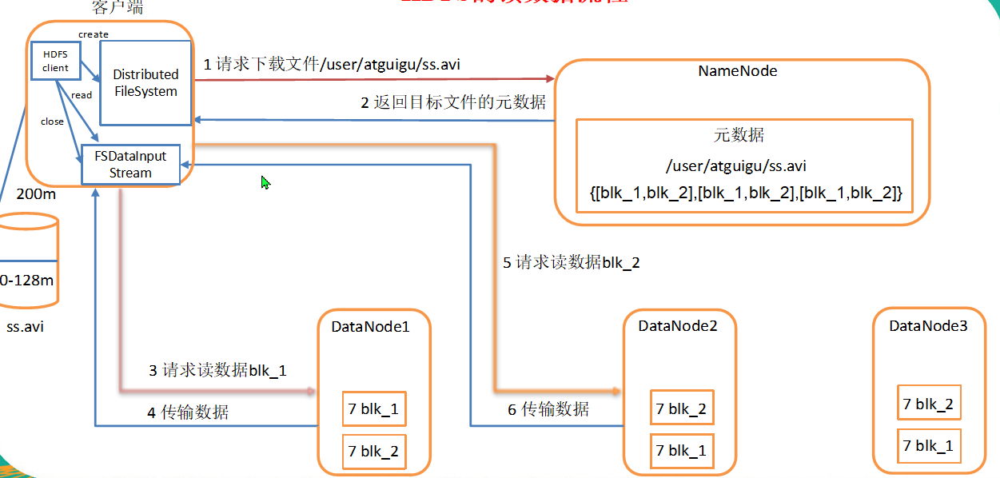

# HDFS的数据流

- [HDFS的数据流](#hdfs%e7%9a%84%e6%95%b0%e6%8d%ae%e6%b5%81)
  - [HDFS的数据上传（写流程）](#hdfs%e7%9a%84%e6%95%b0%e6%8d%ae%e4%b8%8a%e4%bc%a0%e5%86%99%e6%b5%81%e7%a8%8b)
  - [HDFS的数据下载（读流程）](#hdfs%e7%9a%84%e6%95%b0%e6%8d%ae%e4%b8%8b%e8%bd%bd%e8%af%bb%e6%b5%81%e7%a8%8b)

HDFS的数据流包括上传和下载的数据流

## HDFS的数据上传（写流程）

1. 客户端创建一个`Distributed File System` 对象，这个对象向配置中的`NameNode`发起请求上传的请求
2. `NameNode`处理请求，检查权限，是否可以上传等，如果可以上传回复一个消息。
3. 客户端根据配置文件按块上传，读取一个128M的数据开始上传一个`Block`,请求返回配置中的副本数量的`Datanode`。
4. `NameNode`根据请求信息根据空间和距离等信息，返回三个按照机架感知选择的`DataNode`, DN1,DN2,DN3.
5. 客户端创建一个`FSDataOutputStream`将数据写出。
6. 在数据传输时采取`pipeLine`的方式传播，在三个DN中 ，客户端只与DN1进行连接，与DN1连接后，DN1再与DN2连接，DN2再与DN3连接。应答成功的信号也是从DN3-->DN2-->DN1-->client.
7. 在收到DN1的应答成功信号以后，`FSDataOutputStream`就将数据写出到DN1，以Packet的方式进行传输。
8. 一次传输一个块的数据，在传输时一个块由一个一个的64k的packet传输，packet由512 + 4（校验位） B的chunk组成。传输时有两个队列，`dataQueue` 和`ackQueue`，dataQueue中为封装好的待发送的packet,ackQueue中为正在发送的packet。发送时，输出流将首先从dataQueue中选一个packet，把他传送到第一个节点。

## HDFS的数据下载（读流程）

1. 客户端建立一个Distributed FileSystem对象向NN请求下载，NN中存储有元数据，NN查看权限自己有没有等信息后回复
2. NN返回目标文件的元数据
3. 客户端就建立一个InputStream去读取，从元数据指示的的DataNode中去请求读取。
4. 传输数据写入目标文件之中。

