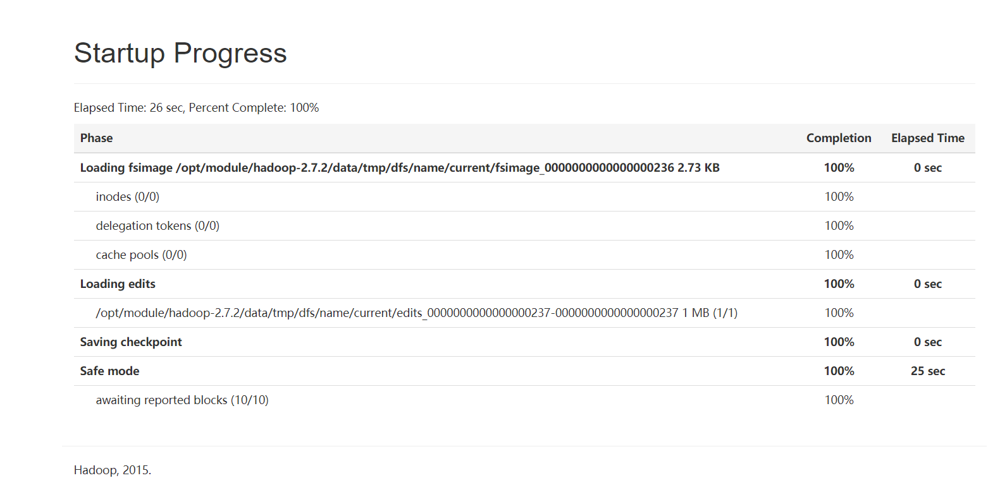

# HDFS三兄弟（NN,DN,2NN）

- [HDFS三兄弟（NN,DN,2NN）](#hdfs%e4%b8%89%e5%85%84%e5%bc%9fnndn2nn)
  - [NN](#nn)
    - [NN的持久化](#nn%e7%9a%84%e6%8c%81%e4%b9%85%e5%8c%96)
    - [NN的启动](#nn%e7%9a%84%e5%90%af%e5%8a%a8)
    - [查看edits和fsimage文件](#%e6%9f%a5%e7%9c%8bedits%e5%92%8cfsimage%e6%96%87%e4%bb%b6)
    - [NN和DN进行通信](#nn%e5%92%8cdn%e8%bf%9b%e8%a1%8c%e9%80%9a%e4%bf%a1)
    - [NN的多目录配置](#nn%e7%9a%84%e5%a4%9a%e7%9b%ae%e5%bd%95%e9%85%8d%e7%bd%ae)
  - [2NN](#2nn)
    - [2NN的辅助作用](#2nn%e7%9a%84%e8%be%85%e5%8a%a9%e4%bd%9c%e7%94%a8)
    - [使用2NN对NN进行恢复](#%e4%bd%bf%e7%94%a82nn%e5%af%b9nn%e8%bf%9b%e8%a1%8c%e6%81%a2%e5%a4%8d)
  - [DN](#dn)
    - [DN的启动](#dn%e7%9a%84%e5%90%af%e5%8a%a8)
    - [服役新节点](#%e6%9c%8d%e5%bd%b9%e6%96%b0%e8%8a%82%e7%82%b9)
    - [白名单配置](#%e7%99%bd%e5%90%8d%e5%8d%95%e9%85%8d%e7%bd%ae)
    - [黑名单配置](#%e9%bb%91%e5%90%8d%e5%8d%95%e9%85%8d%e7%bd%ae)
    - [DN的多目录机制](#dn%e7%9a%84%e5%a4%9a%e7%9b%ae%e5%bd%95%e6%9c%ba%e5%88%b6)
  - [HDFS2.X新特性](#hdfs2x%e6%96%b0%e7%89%b9%e6%80%a7)
    - [集群复制](#%e9%9b%86%e7%be%a4%e5%a4%8d%e5%88%b6)
    - [归档](#%e5%bd%92%e6%a1%a3)

三兄弟叫起来比较顺口，实际来说者三者之间的关系更像，老板，秘书和工人

## NN

NN负责对HDFS上的元数据进行管理，在NN中保存有最重要的两份信息，一是文件由哪些块组成（filename->blocksequence (namespace))。二是每个块存在哪个位置)（block->machinelist("inodes"))。除次之外还有文件名，上传者，上传时间等非关键信息。元数据在磁盘中存储在fsimage之中.

### NN的持久化

NN负责整个HDFS的负载，当客户端对数据进行写操作时会生成元数据。导致元数据不断增加，存在丢失风险，需要对NN中的元数据进行持久化。存在两种持久化的方法,一是将所有的写操作记录下来，形成日志文件。二是将当前内存的数据形成一个快照。前者，记录速度快，但是恢复时需要执行日志中的所有操作，恢复速度极慢。二后者如果内存中的数据越来越多，镜像会越来越大。在运行之间持久化的话，NN可能会瘫痪。

在HDFS中用到这两种的结合：

- NN在运行期间要保证负载不会太高，因此在运行期间不进行第二种image的持久化操作，而是将NN运行时的所有**写操作**命令存储在edits文件之中。每次操作都会生成一个操作id(tx)。edits文件按此命名。
- 对于快照的存储在NN启动时完成，在NN启动时，除了加载已经存储的Fsimage镜像以外，还会将edits日志中记录的操作对fsimage中已经加载的数据进行操作，合并为最新的元数据，合并后再将新的元数据持久到fsimage之中。持久化完成之后再对外提供服务。
  
通过这两者的结合，NN既将数据持久化到了磁盘之中，也再提供服务时保证了自己的负载。相比于只用edits进行恢复，通过fimage将之前的记录作了镜像，恢复的速度更快。

### NN的启动



如图，NN启动时首先会加载fsimage文件，再加载edits文件，加载后生成一个新的fsimgae文件持久化到磁盘。之后进入safemode。在完成加载后hdfs还需要经过安全模式才能完全服务，在安全模式之中hdfs只能读不能写，退出安全模式需要等待DN启动，上报DN当前由哪些快可用，和NN记录的信息意义匹配，满足NN记录的块数量的99.9%（向下取整）就经过30s后自动退出安全模式。当然也能手动进入和退出安全模式。通过命令`hdfs dfsadmin -safemode [leave,enter,get,wait]`。`hdfs dfsadmin -rollEdits` 滚动日志文件。

### 查看edits和fsimage文件

edits和fsimage为序列化的文件，需要借助hadoop提供的方法进行转化，转化命令如下`hdfs oev -P xml -i edits* -o edits.xml`。在edits通过recode记录操作。fsimage文件的操作如下`hdfs oiv -P XML -i image -o image.xml`

### NN和DN进行通信

NN会接收DN上报的块信息，向DN发送维护块的副本数的复制请求，NN在格式化时会生成Cluster ID，NN只有与DN clusterID 一致，才认为NN和DN处于一个Hadoop集群。ClusterID存储在Version之中

```txt
# NN
namespaceID=316424341
clusterID=CID-200d623a-0dd9-481b-be30-72d0f1de5fed
cTime=0
storageType=NAME_NODE
blockpoolID=BP-1750274979-192.168.6.101-1573653634195   和DN存储block的文件夹名字一致
layoutVersion=-63
```

```txt
## DN
storageID=DS-68719249-0a4a-498b-a801-f5783bcf888a
clusterID=CID-200d623a-0dd9-481b-be30-72d0f1de5fed
cTime=0
datanodeUuid=88e201b7-5eca-494c-8c99-3f06d76477fa
storageType=DATA_NODE
layoutVersion=-56
```

在格式化之后生成的新的fsimage的clusterID的变化了，与DN失联

### NN的多目录配置

由于NN中的数据过于重要，所以可以在NN的多块磁盘上对NN中的数据进行配置。值得注意的是多个目录之间存储的数据完全一致，并且在配置文件中的第一个目录坏了后，需要将其他目录提取到前面。因为NN启动时默认读第一个目录。
在hdfs-site.xml中配置

```xml
<property>
    <name>dfs.namenode.name.dir</name>
<value>dir1,dir2,dir3</value>
</property>
```

## 2NN

在HDFS中，NN和2NN是两个不同类型的进程，2NN只能起到辅助作用，不能代替NN。

### 2NN的辅助作用

在NN启动时会将上次运行时产生的edits和fsimage进行合并，但是如果上次存储的edits过多，运行太多了，那启动时速度就会很慢，为解决这一矛盾，2NN出现了。2NN负责将NN在运行期间产生的edits文件和fsimage文件合并。合并之后产生新的fsimage文件并替换原有的fsimage。

1. 请求是否需要CheckPoint.触发条件100w次写操作，一个小时
2. 请求执行CheckPoint
3. 滚动正在写的Edits文件，生成一个新的文件给NN使用
4. 将fsimage和edits文件拷贝到2NN
5. 执行合并操作并将fsimage发给NN

参数有 dfs.namenode.checkpoint.txns=100w\
dfs.namenode.checkpoint.period=3600s\
dfs.namenode.checkpoint.check.period=60s\
每间隔dfs.namenode.checkpoint.period，合并一次！\
每间隔dfs.namenode.checkpoint.check.period检查txns是否达到dfs.namenode.checkpoint.txns，\
一旦达到，不管是否满足dfs.namenode.checkpoint.period，都会执行合并！

除了可以降低NN启动时的时间消耗以外，由于2NN复制了NN中的edits文件和fsimage文件，因此如果NN发生了磁盘损坏，可以通过2NN对NN进行部分恢复（2NN执行备份时NN的新操作无法保存）

### 使用2NN对NN进行恢复

将2NN,namesecondary中的current复制到NN下的name下就行

## DN

### DN的启动

1. DN启动后首先向NN根据clusterID进行注册，
2. 注册成功后，以后每1小时上报所有的块信息
3. 每三秒ping以下NN，
4. 如果NN十分钟30秒没有收到DN的心跳，则认为DN坏了。

```java
TimeOut = 2 * dfs.namenode.heartbeat.recheck-interval + 10 * dfs.heartbeat.interval，
// 而默认的recheck-interval为5min，dfs.heartbeat.interval默认为3s.
```

### 服役新节点

1. 配置host和hosts还有本机ip
2. 配置好ssh
3. 分发hadoop和java
4. 如果hadoop中有上个文件的logs信息，要删除
5. 启动DataNode.即可关联到集群

### 白名单配置

设置白名单后，只有白名单之上的主机才能注册。在NN运行的机器执行代码

```xml
<property>
<name>dfs.hosts</name>
<value>文件路径</value>
</property>
```

重启NN或执行`hdfs dfsadmin -refreshNodes`

### 黑名单配置

在配置进入黑名单后，会交接工作。

```xml
<property>
<name>dfs.hosts.exclude</name>
      <value>/opt/module/hadoop-2.7.2/etc/hadoop/dfs.hosts.exclude</value>
</property>
```

### DN的多目录机制

```xml
<property>
        <name>dfs.datanode.data.dir</name>
<value>file:///${hadoop.tmp.dir}/dfs/data1,file:///${hadoop.tmp.dir}/dfs/data2</value>
</property>
```

修改配置文件即可，与NN的多目录不同，DN的多目录中存储的文件不是一致的，偏向于实现负载均衡。

## HDFS2.X新特性

### 集群复制

集群复制`hadoop distcp 集群1 集群2`

### 归档

HDFS存档：归档是文件数量上的变化，压缩是体积上的变化。归档时可以顺便压缩

在线归档就是一个mapreduce。

`hadoop archive -archiveName hi.har -p  / hi hi2 hi3 hi4 /` -p后加目录，最后是输出目录，归档不删除原文件。
使用archive归档的文件一般命名为 XX.har

解归档：`hadoop fs -ls har:///hi.har`查看  
`hadoop fs -cp har:///hi.har /dehar`
