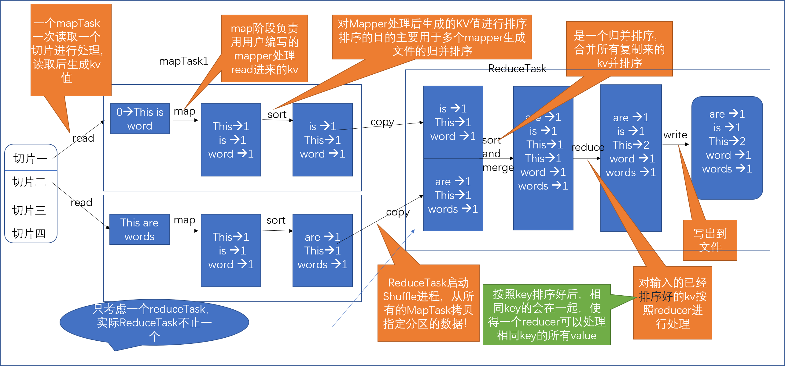

# MapReduce

- [MapReduce](#mapreduce)
  - [MapReduce图解](#mapreduce%e5%9b%be%e8%a7%a3)
  - [MapTask](#maptask)
    - [Read](#read)
    - [Map](#map)
    - [Sort](#sort)
  - [ReduceTask](#reducetask)
    - [Copy](#copy)
    - [Sort and Merge](#sort-and-merge)
    - [Reduce&Write](#reducewrite)
  - [一个简单的wordCount](#%e4%b8%80%e4%b8%aa%e7%ae%80%e5%8d%95%e7%9a%84wordcount)
    - [mapper](#mapper)
    - [reducer](#reducer)
    - [Driver](#driver)

## MapReduce图解



如图是MapReduce的一个运行示例，从中可以看出MapReduce主要包括两个部分，第一个是MapTask,第二个是ReduceTask。两个部分又由一些具体的步骤组成，MapTask包括read, map, sort三个部分。ReduceTask包括copy, sort and merge, reduce以及write四个部分，接下来将粗略的介绍七个步骤，具体的介绍和源码分析在之后的章节。

## MapTask

### Read

Read：从文件系统中读取数据，读取时按照split读取，一个节点在执行一次mapTask时要从文件系统中`FileSystem`中通过`RecordReader`读取一个切片的数据，split的大小默认和block的大小一致(原因是这样可以使用移动运算不移动数据，比如在node1上有一个块的数据，当需要对这个块进行操作时可以将jar发送到这个节点，由该节点执行运算，如果块的大小大于一个块，那么这个块在执行运算时还需要与其他节点有网络传输，耗费IO资源)。read后数据成了key-value形式。

### Map

Map：Map阶段主要是用于执行用户自定义的Map程序用于处理key-value，在Map阶段中，编写的Map程序一次处理一个Key-Value,并且重新将处理好的数据也是key-value的形式。

### Sort

Sort：对Map处理后的数据进行排序，排序的规则可以指定，进行排序的主要目的在于，在mapreduce中数据是序列化的，所以通过排序可以实现分区，分组。sort后的key写入磁盘等待reduce的copy。

## ReduceTask

### Copy

Copy：执行Reduce的节点通过Copy拉取mapTask处理后的生成的文件，值得注意的是一个Reduce需要Copy所有MapTask处理后生成的文件（其实这样也不太准确，Reduce需要copy的是同一个区的件，有些MapTask不一定有生成）。

### Sort and Merge

一个Reduce在将所有的所有的Map处理的数据copy过来后，要做两件事一是将所有需要的key-value合并，二是对合并的数据进行排序。合并不必多说，排序的原因在于一个reduce要对相同的key的key-value进行操作，所以通过排序就可以让有Key相同的在同一位置，这样就实现了一次简单的分组。

### Reduce&Write

Reduce按照用户编写的逻辑一次对具有相同key的所有key-value进行操作。操作后写出到磁盘或者hdfs上。

## 一个简单的wordCount

对于hadoop来说，wordCount就如同一个helloWorld。写了wordCount后，hadoop的正式开始~

### mapper

重要的是`<LongWritable,Text,Text,IntWritable>`泛型要写对，第一二个来自于InputFormat,这个需要由需求来定,第三四个取决于代码的编写逻辑。

```java
public class wordCountMapper extends Mapper<LongWritable,Text,Text,IntWritable> {

    private Text outKey = new Text();
    private IntWritable outValue = new IntWritable(1);

    @Override
    protected void map(LongWritable key, Text value, Context context) throws IOException, InterruptedException{
        String[] words = value.toString().split(" ");
        for (String word : words) {
            outKey.set(word);
            context.write(outKey,outValue);
        }

    }
}
```

### reducer

从代码上说不难

```java
public class wordCountReducer extends Reducer<Text,IntWritable,Text,IntWritable> {

    private int sum;

    @Override
    protected void reduce(Text key, Iterable<IntWritable> values, Context context) throws IOException, InterruptedException {
        sum = 0;
        for (IntWritable value : values) {
            sum=sum+1;
        }
        context.write(key,new IntWritable(sum));
    }
}
```

### Driver

套路写法不难，注意的是所有的配置都要写在`job.waitForCompletion(true);`之前。不然会报State为Running的异常。

```java
public class wordCountDriver {
    public static void main (String[] args) throws Exception{
        Configuration conf = new Configuration();
        conf.set("fs.defaultFS","hdfs://hadoop101:9000");

        FileSystem fs = FileSystem.get(conf);

        Path inputPath = new Path("/HDFS.txt");
        Path outputPath = new Path("/output1");

        if(fs.exists(outputPath)){
            fs.delete(outputPath,true);
        }
        Job job = Job.getInstance(conf,"wc");
        job.setMapperClass(wordCountMapper.class);
        job.setReducerClass(wordCountReducer.class);

        FileInputFormat.setInputPaths(job,inputPath);
        FileOutputFormat.setOutputPath(job,outputPath);
        job.setNumReduceTasks(3);
        //如果涉及序列化，
        job.setMapOutputKeyClass(Text.class);
        job.setMapOutputValueClass(IntWritable.class);

        job.setOutputKeyClass(Text.class);
        job.setOutputValueClass(IntWritable.class);

        job.waitForCompletion(true);

    }
}
```
