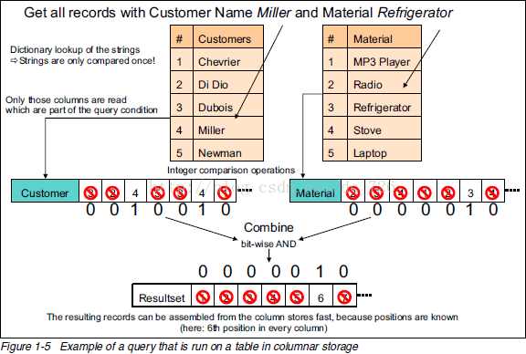

# Hive 压缩

Hadoop的job通常是I/O密集型而不是CPU密集型的，因此通过增加Cpu的运算减少mapreduce的任务操作是值得的。对于压缩的编解码格式的选取策略与mapreduce类似，在实际应用中Hive中使用的数据存储格式常为orc+snappy 和 parquet+lzo.orc用于仅仅使用hive的场景，parquet使用于hive和spark等配合使用的场景。

## Hive压缩配置

在使用mapreduce进行计算时hive的压缩配置可以分为中间压缩（map输出的压缩）和结果压缩（reduce输出的压缩）

### 开启中间压缩（Mapper）

```shell
set hive.exec.compress.intermediate=true;
set mapreduce.map.output.compress=true;
set mapreduce.map.output.compress.codec=org.apache.hadoop.io.compress.SnappyCodec;
```

### 开启结果压缩（Reducer）

```shell
set hive.exec.compress.output=true;
set mapreduce.output.fileoutputformat.compress=true;
set mapreduce.output.fileoutputformat.compress.codec = org.apache.hadoop.io.compress.SnappyCodec;
```

## Hive的文件存储格式

Hive支持的存储数的格式主要有：TEXTFILE 、SEQUENCEFILE、ORC、PARQUET。注意表只是一个落成概念，

### 列式存储

列式存储就是将一列的数据放在一起，例如将name这一字段下的值存在一个连续的内存区，age这一列的值存在一个连续的内存区。列式存储的好处在于便于筛选列，便于查询。不适合update和insert。使用大数据得存储，可以查特定几列，或者在按照特定列排序或者分组的情况比较适合。如图在查询两个具有两个条件的记录时列式存储的性能极快



### 行式存储

行式存储就是将一行的数据放在一起，所有的数据都被保存在一起，insert和update容易。

### TextFile格式

默认格式，数据不做压缩，磁盘开销大，数据解析开销大。可结合Gzip、Bzip2使用，但使用Gzip这种方式，hive不会对数据进行切分，从而无法对数据进行并行操作。

### Orc格式

行列结合，一个ORC由多个stripe组成，若干行分成一个行组，每个行组由stripe footer，Row data和index Data组成。

- stripe footer：存储的是元数据列名，列类型
- index Data:索引数据
- Row data：行数据，行组中的数据以列存储

整个文件还有 File Footer，这里面存的是每个Stripe的行数，每个Column的数据类型信息等

每个文件的尾部是一个PostScript，这里面记录了整个文件的压缩类型以及FileFooter的长度信息等。

### Parquet

Parquet文件是以二进制方式存储的，所以是不可以直接读取的，文件中包括该文件的数据和元数据，因此Parquet格式文件是自解析的。

通常情况下，在存储Parquet数据的时候会按照Block大小设置行组的大小，由于一般情况下每一个Mapper任务处理数据的最小单位是一个Block，这样可以把每一个行组由一个Mapper任务处理，增大任务执行并行度。行组里面按照列式存储。没有索引页，效率比orc要低

