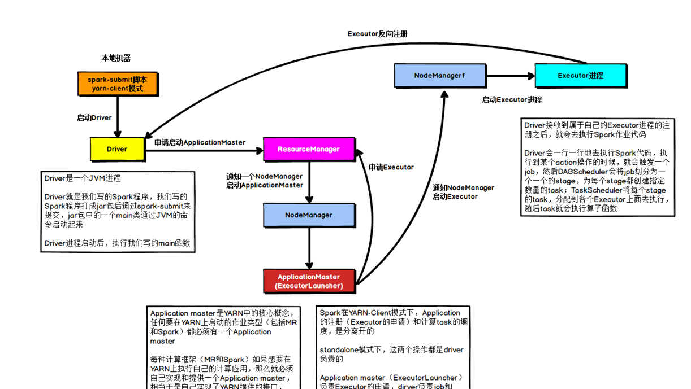

# Spark源码

## Yarn部署流程

### Submit
- SparkSubmit
  -  main
       -  new SparkSubmitArguments（调用Handle用于封装参数  ）
           -  ``` override protected def handle(opt: String, value:String: Boolean = {opt match {case NAME => name = valuecase MASTER =>master = value....}```
       - case SparkSubmitAction.SUBMIT => submit(appArgs) 获取action，默认为submit
           - prepareSubmitEnvironment(args) 准备提交环境
               - childMainClass = "org.apache.spark.deploy.yarn.Client"
           - doRunMain(runMain),runMain得参数为prepareSubmitEnvironment的返回值((childArgs, childClasspath, sysProps, childMainClass))
                - Utils.classForName(childMainClass)（反射加载类）
                - val mainMethod = mainClass.getMethod("main", new Array[String](0).getClass)（查找main方法）
                - mainMethod.invoke(null, childArgs.toArray)（执行childMainClass的main方法）

- org.apache.spark.deploy.yarn.Client
  - main
    - val args = new ClientArguments(argStrings)准备参数
    - new Client(args, sparkConf)
        - yarnClient = YarnClient.createYarnClient // 准备客户端对象
    - Client.run()，new一个client并运行
        -  this.appId = submitApplication()// 全局唯一id
            - `setupCredentials() yarnClient.init(yarnConf) yarnClient.start()`
            - val containerContext = createContainerLaunchContext(newAppResponse)// 封装指令 command `/bin/java org.apache.spark.deploy.yarn.ApplicationMaster + 各种参数` ，由此启动了一个ApplicationMaster进程
            - val appContext = createApplicationSubmissionContext(newApp, containerContext)
            - yarnClient.submitApplication(appContext) // 向Yarn提交应用,实际是提交命令行指令

### ApplicationMaster
- ApplicationMaster
  - main
    - val amArgs = new ApplicationMasterArguments(args)（调用Handle用于封装参数）
    - new ApplicationMaster(amArgs, new YarnRMClient) // YarnRMClient用于与RM通信
    - master.run（运行）
        - runDriver() //就是运行我们编写的程序
            - startUserApplication 启动用户应用
                - val mainMethod = userClassLoader.loadClass(args.userClass).getMethod("main", classOf[Array[String]]) 获取用户应用的类的main方法
                - new Thread().start 启动线程  执行mainMethod
            - 向Yarn注册AM registerAM(sc.getConf, rpcEnv, driverRef, sc.ui.map(_.appUIAddress).getOrElse(""),securityMgr)
                - client.register 获取yarn资源
                - allocator.allocateResources() 分配资源
                    - handleAllocatedContainers 处理分配资源，这里就实现了移动计算不移动数据，本地化
                        - runAllocatedContainers 运行container
                            - new ExecutorRunnable().run 创建一个NMclient
                            - ExecutorRunnable().run      与NM进行交互
                                - startContainer
                                    - prepareCommand 依旧是准备一个command执行。/bin/java org.apache.spark.executor.CoarseGrainedExecutorBackend


- CoarseGrainedExecutorBackend
  -  @volatile var driver: Option[RpcEndpointRef] = None是类的一个属性
  - main
    - run(driverUrl, executorId, hostname, cores, appId, workerUrl, userClassPath)
      - onstart
        - Driver.ask[Boolean](RegisterExecutor(executorId, self, hostname, cores, extractLogUrls))}(ThreadUtils.sameThread).onComplete  （on start）
      - receive
        - executor = new Executor(executorId, hostname, env, userClassPath, isLocal = false) //创建计算对象 (on recieve)
)


scala中参数的匹配

```java
 while (!args.isEmpty) {
      // --num-workers, --worker-memory, and --worker-cores are deprecated since 1.0,
      // the properties with executor in their names are preferred.
      args match {
        case ("--jar") :: value :: tail =>
          userJar = value
          args = tail

        case ("--class") :: value :: tail =>
          userClass = value
          args = tail

        case ("--primary-py-file") :: value :: tail =>
          primaryPyFile = value
          args = tail

        case ("--primary-r-file") :: value :: tail =>
          primaryRFile = value
          args = tail

        case ("--arg") :: value :: tail =>
          userArgsBuffer += value
          args = tail

        case ("--properties-file") :: value :: tail =>
          propertiesFile = value
          args = tail

        case _ =>
          printUsageAndExit(1, args)
      }
    }
```


### Spark源码中特殊的类

1. launcherBackend： 后台
2. rpcEnv:RPC进程间交互的规则
3. amEndpoint：终端
4. RpcEndpointAddress：RPC终端地址

### SparkRPC通信


### Spark任务调度


 


