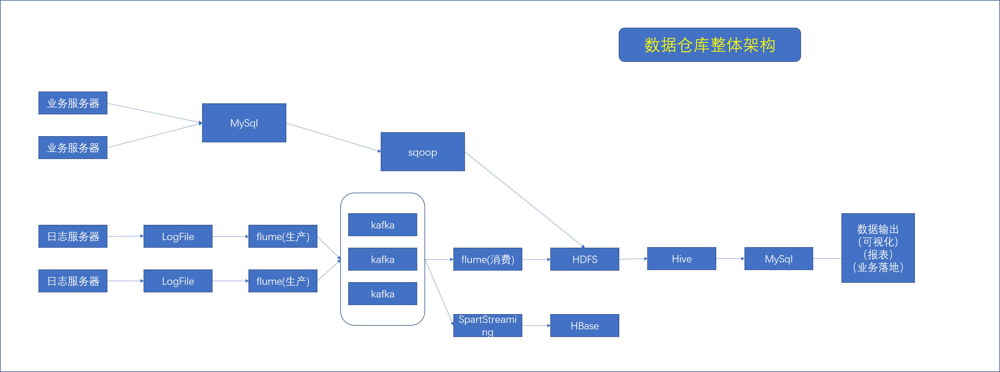
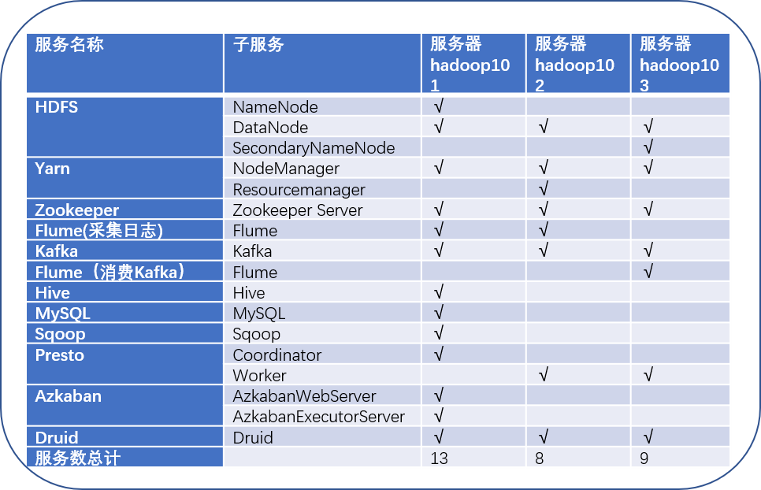

# 数据仓库架构

## 基础概念

数据仓库：是为企业所有决策制定过程，提供所有系统数据支持的战略结合。它从日志采集系统，业务处理系统中收集数据。为报表系统，用户画像系统，推荐系统等提供支持。

本系统简述，本系统在数据采集传输中使用Flume，kafka，sqoop.数据存储中采用mysql和hdfs，使用hive，tze和spark进行数据计算，使用Presto进行即席查询。

如图，本仓库根据尚硅谷文档制作

从图中可以看出，在写入HDFS前，数仓分为业务数据仓库和日志数据两部分

业务数据：来自于Web/app与用户交互后生产的数据，有例如登录，订单、用户信息、商品信息、支付信息等等相关信息。通常是结构化信息

日志数据：用户在使用产品过程中，与客户端交互过程中产生的数据，例如页面浏览，点击停留，评论等等的数据。通常是非结构化信息

本次数据仓库项目使用的框架版本号为：hadoop2.7.2 flume 1.7 , kafka 0.11.0.2, hive 1.2.1 sqoop 1.4.6 mysql 5.6 java 1.8 zookeeper 3.4.1

本次数据仓库的环境为vmwareworkstation,三台虚拟机，内存分别为3g(hadoop101),4g(hadoop102),3g(hadoop103).

三台虚拟机安装的服务如下

hadoop101和hadoop102产生日志数据，hadoop101产生业务数据，在三台机器搭建hadoop集群，其中hadoop101为nn,hadoop102为rm。